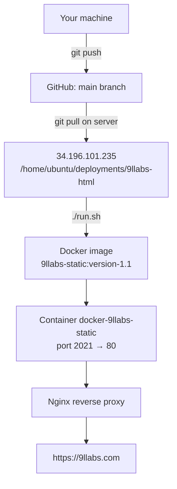

# 9llabs Static Website

The 9llabs.com marketing site — static HTML/CSS/JS served by PHP-Apache in Docker.

- **Live:** https://9llabs.com
- **Served from:** `src/` (the container's web root)
- **Container port:** `2021` → Nginx reverse proxy → `9llabs.com`

---

## Repository Layout

| Path | What it is |
|------|------------|
| `src/` | The website. Everything here is served. |
| `src/index.php` | Home page — all sections including Careers. |
| `src/mail.php` | Contact form handler. Accepts POST only; sends to `info@9llabs.com`. |
| `src/assets/` | CSS, JS, fonts, images. |
| `Satori/` | Separate standalone page. **Not deployed** — the Dockerfile only copies `src/`. |
| `Dockerfile` | Builds `php:7.4-apache` with the site baked in. |
| `run.sh` | Build + restart the container on the server. |

---

## Deploy a Change

Four steps. Run them in order.

### 1. Push your change to `main`

```bash
git add src/
git commit -m "Describe the change"
git push origin main
```

Nothing deploys until it is on `main` — the server pulls from there.

### 2. Connect to the server

```bash
ssh -i 9llabs.pem route@34.196.101.235
```

You need the `9llabs.pem` private key. Get it from the team's secure channel — it is **not** in this repository and must never be committed.

If SSH refuses with `WARNING: UNPROTECTED PRIVATE KEY FILE!`, the key is readable by other users on your machine. Lock it down, then reconnect:

```bash
chmod 400 9llabs.pem
ssh -i 9llabs.pem route@34.196.101.235
```

### 3. Pull and rebuild

```bash
cd /home/ubuntu/deployments/9llabs-html
git pull
./run.sh
```

`run.sh` builds the image `9llabs-static:version-1.1`, stops and removes the old container, and starts a new one named `docker-9llabs-static` on port 2021.

### 4. Verify

```bash
sudo docker ps                 # docker-9llabs-static should be Up
curl http://localhost:2021     # should return the site HTML
```

Then open https://9llabs.com in a browser and confirm your change is visible.

---

## How a Change Reaches Production



---

## Run It Locally

You do not need the server to preview a change. Mount `src/` into the stock PHP image — no build, and edits appear on refresh:

```bash
docker run -d --name 9llabs-dev -p 2021:80 \
  -v "$PWD/src":/var/www/html php:7.4-apache
```

Open http://localhost:2021. Stop it with `docker rm -f 9llabs-dev`.

Two things behave differently from production:

- **The contact form will not send.** There is no mail server in the container, so submitting returns a 500. Opening `mail.php` in a browser returns 403 — that is correct, it only accepts POST.
- **`Satori/` is not served**, matching production.

---

## Command Reference

Everything above, condensed:

```bash
# Deploy
ssh -i 9llabs.pem route@34.196.101.235
cd /home/ubuntu/deployments/9llabs-html
git pull
./run.sh
sudo docker ps
curl http://localhost:2021

# Preview locally
docker run -d --name 9llabs-dev -p 2021:80 -v "$PWD/src":/var/www/html php:7.4-apache
docker rm -f 9llabs-dev

# Server-side troubleshooting
sudo docker logs docker-9llabs-static     # container output
sudo docker ps -a                         # is it running, or did it exit?
```
